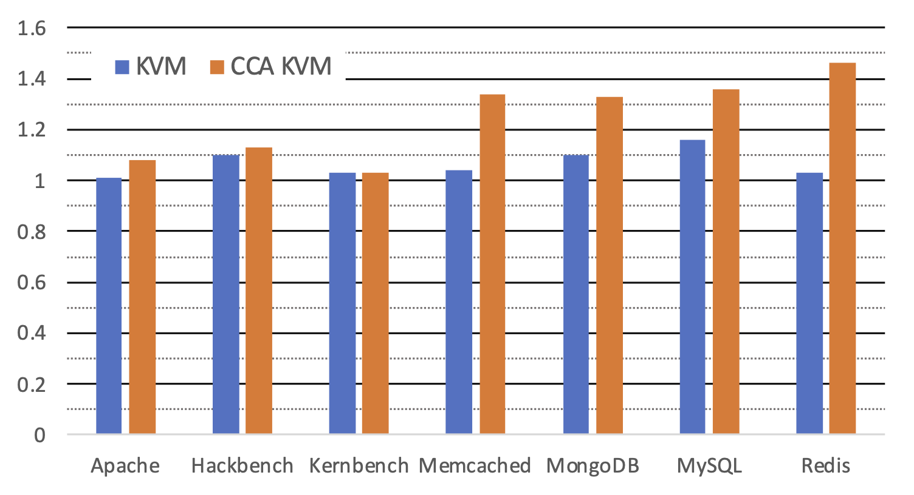
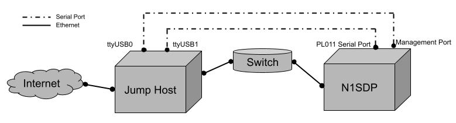

# Design and Verification of the Arm Confidential Compute Architecture

This artifact includes the mechanized Coq proofs for the security of RMM/EL3M, the verified software stack for the Arm Confidential Compute Architecture (CCA). It also provides instructions on running the performance evaluations of CCA KVM.

# Table of Contents

## 1. Coq Proofs

We first provide instructions to install Coq proof assistant and check our mechanized proofs by compilation. Then, we summarize the proof sketch.

### 1.1 Coq installation

We use `opam` to install Coq and other dependencies. To install `opam`:
  ```
  - Ubuntu:
    sudo apt install opam

  - Mac OS X:
    brew install opam
  ```
Then, initialize `opam` with the specific version `4.02.0`:
  ```
  opam init compiler 4.02.0
  ```
If you already have `opam` installed which has a different version, switch to `4.02.0`:
  ```
  opam switch create 4.02.0
  ```
Then, use `opam` to install `coq 8.4.6` and `menhir 20151112`
```
opam install coq.8.4.6 menhir.20151112
```
Make sure `coqc` is in `PATH`, or add it manually:
```
export PATH="path/to/.opam/4.02.0/bin":$PATH
```
`.opam/` is usually in user's home directory.

### 1.2 Compile the proofs

Under the root folder of this repo, simply run
```
make -j6
```
to check all the coq proofs. Use a smaller process number if the compilation runs out of memory. The compilation may take a few hours.

### 1.3 Proof Organization

#### 1.3.1 Layering Refinement Proof

The proof is organized as layers, one folder a layer (e.g. `proof/BaremoreService`). In each layer, we introduce new functions, define specifications for them, and prove the functions' implementation refine their specifications. We provide the ASTs compiled from the C source code in each layer's `Code/` folder which are generated by the tool `clightgen` of `CompCert` project. The ASTs play the role of source code in our proof. The specifications of each layer are defined in `Specs/` folder. We do two-step simulation when proving code refines specifications. We first prove that the ASTs refine some intermediate specifications (in `LowSpecs/`), then prove the intermediate specifications refine the final specifications (in `Specs/`). The simulation proofs are in `CodeProof/` (Code Verification) and `RefProof/` (Refinement) respectively.

The definition of the machine states shared by all layers is in [RData](proof/RData.v) and the bottom layer primitives are defined in [AbsAccessor](proof/AbsAccessor/Spec.v). A full list of layers is shown below:
| #  | **Layer**               | **Source Code**        | **Specification**      | **Intermediate Specification** | **Code Verification**       | **Refinement**           |
| -- | -----                   | -------------          | -----------------      | -----------            | -------------     | ----------               |
|1|[BaremoreService](proof/BaremoreService/)|[Code](proof/BaremoreService/Code)|[Specs](proof/BaremoreService/Specs)|[LowSpecs](proof/BaremoreService/LowSpecs)|[CodeProof](proof/BaremoreService/CodeProof/)|[RefProof](proof/BaremoreService/RefProof/)|
|2|[BaremoreHandler](proof/BaremoreHandler/)|[Code](proof/BaremoreHandler/Code)|[Specs](proof/BaremoreHandler/Specs)|[LowSpecs](proof/BaremoreHandler/LowSpecs)|[CodeProof](proof/BaremoreHandler/CodeProof/)|[RefProof](proof/BaremoreHandler/RefProof/)|
|3|[BaremoreSMC](proof/BaremoreSMC/)|[Code](proof/BaremoreSMC/Code)|[Specs](proof/BaremoreSMC/Specs)|[LowSpecs](proof/BaremoreSMC/LowSpecs)|[CodeProof](proof/BaremoreSMC/CodeProof/)|[RefProof](proof/BaremoreSMC/RefProof/)|
|4|[RmiAux](proof/RmiAux/)|[Code](proof/RmiAux/Code)|[Specs](proof/RmiAux/Specs)|[LowSpecs](proof/RmiAux/LowSpecs)|[CodeProof](proof/RmiAux/CodeProof/)|[RefProof](proof/RmiAux/RefProof/)|
|5|[RmiAux2](proof/RmiAux2/)|[Code](proof/RmiAux2/Code)|[Specs](proof/RmiAux2/Specs)|[LowSpecs](proof/RmiAux2/LowSpecs)|[CodeProof](proof/RmiAux2/CodeProof/)|[RefProof](proof/RmiAux2/RefProof/)|
|6|[RmiOps](proof/RmiOps/)|[Code](proof/RmiOps/Code)|[Specs](proof/RmiOps/Specs)|[LowSpecs](proof/RmiOps/LowSpecs)|[CodeProof](proof/RmiOps/CodeProof/)|[RefProof](proof/RmiOps/RefProof/)|
|7|[RmiSMC](proof/RmiSMC/)|[Code](proof/RmiSMC/Code)|[Specs](proof/RmiSMC/Specs)|[LowSpecs](proof/RmiSMC/LowSpecs)|[CodeProof](proof/RmiSMC/CodeProof/)|[RefProof](proof/RmiSMC/RefProof/)|
|8|[PSCIAux](proof/PSCIAux/)|[Code](proof/PSCIAux/Code)|[Specs](proof/PSCIAux/Specs)|[LowSpecs](proof/PSCIAux/LowSpecs)|[CodeProof](proof/PSCIAux/CodeProof/)|[RefProof](proof/PSCIAux/RefProof/)|
|9|[PSCIAux2](proof/PSCIAux2/)|[Code](proof/PSCIAux2/Code)|[Specs](proof/PSCIAux2/Specs)|[LowSpecs](proof/PSCIAux2/LowSpecs)|[CodeProof](proof/PSCIAux2/CodeProof/)|[RefProof](proof/PSCIAux2/RefProof/)|
|10|[PSCI](proof/PSCI/)|[Code](proof/PSCI/Code)|[Specs](proof/PSCI/Specs)|[LowSpecs](proof/PSCI/LowSpecs)|[CodeProof](proof/PSCI/CodeProof/)|[RefProof](proof/PSCI/RefProof/)|
|11|[PSCIHandler](proof/PSCIHandler/)|[Code](proof/PSCIHandler/Code)|[Specs](proof/PSCIHandler/Specs)|[LowSpecs](proof/PSCIHandler/LowSpecs)|[CodeProof](proof/PSCIHandler/CodeProof/)|[RefProof](proof/PSCIHandler/RefProof/)|
|12|[RVIC](proof/RVIC/)|[Code](proof/RVIC/Code)|[Specs](proof/RVIC/Specs)|[LowSpecs](proof/RVIC/LowSpecs)|[CodeProof](proof/RVIC/CodeProof/)|[RefProof](proof/RVIC/RefProof/)|
|13|[RVIC2](proof/RVIC2/)|[Code](proof/RVIC2/Code)|[Specs](proof/RVIC2/Specs)|[LowSpecs](proof/RVIC2/LowSpecs)|[CodeProof](proof/RVIC2/CodeProof/)|[RefProof](proof/RVIC2/RefProof/)|
|14|[RVIC3](proof/RVIC3/)|[Code](proof/RVIC3/Code)|[Specs](proof/RVIC3/Specs)|[LowSpecs](proof/RVIC3/LowSpecs)|[CodeProof](proof/RVIC3/CodeProof/)|[RefProof](proof/RVIC3/RefProof/)|
|15|[RVIC4](proof/RVIC4/)|[Code](proof/RVIC4/Code)|[Specs](proof/RVIC4/Specs)|[LowSpecs](proof/RVIC4/LowSpecs)|[CodeProof](proof/RVIC4/CodeProof/)|[RefProof](proof/RVIC4/RefProof/)|
|16|[PendingCheckAux](proof/PendingCheckAux/)|[Code](proof/PendingCheckAux/Code)|[Specs](proof/PendingCheckAux/Specs)|[LowSpecs](proof/PendingCheckAux/LowSpecs)|[CodeProof](proof/PendingCheckAux/CodeProof/)|[RefProof](proof/PendingCheckAux/RefProof/)|
|17|[PendingCheck](proof/PendingCheck/)|[Code](proof/PendingCheck/Code)|[Specs](proof/PendingCheck/Specs)|[LowSpecs](proof/PendingCheck/LowSpecs)|[CodeProof](proof/PendingCheck/CodeProof/)|[RefProof](proof/PendingCheck/RefProof/)|
|18|[CtxtSwitchAux](proof/CtxtSwitchAux/)|[Code](proof/CtxtSwitchAux/Code)|[Specs](proof/CtxtSwitchAux/Specs)|[LowSpecs](proof/CtxtSwitchAux/LowSpecs)|[CodeProof](proof/CtxtSwitchAux/CodeProof/)|[RefProof](proof/CtxtSwitchAux/RefProof/)|
|19|[CtxtSwitch](proof/CtxtSwitch/)|[Code](proof/CtxtSwitch/Code)|[Specs](proof/CtxtSwitch/Specs)|[LowSpecs](proof/CtxtSwitch/LowSpecs)|[CodeProof](proof/CtxtSwitch/CodeProof/)|[RefProof](proof/CtxtSwitch/RefProof/)|
|20|[RealmTimerHandler](proof/RealmTimerHandler/)|[Code](proof/RealmTimerHandler/Code)|[Specs](proof/RealmTimerHandler/Specs)|[LowSpecs](proof/RealmTimerHandler/LowSpecs)|[CodeProof](proof/RealmTimerHandler/CodeProof/)|[RefProof](proof/RealmTimerHandler/RefProof/)|
|21|[RealmSyncHandlerAux](proof/RealmSyncHandlerAux/)|[Code](proof/RealmSyncHandlerAux/Code)|[Specs](proof/RealmSyncHandlerAux/Specs)|[LowSpecs](proof/RealmSyncHandlerAux/LowSpecs)|[CodeProof](proof/RealmSyncHandlerAux/CodeProof/)|[RefProof](proof/RealmSyncHandlerAux/RefProof/)|
|22|[RealmSyncHandler](proof/RealmSyncHandler/)|[Code](proof/RealmSyncHandler/Code)|[Specs](proof/RealmSyncHandler/Specs)|[LowSpecs](proof/RealmSyncHandler/LowSpecs)|[CodeProof](proof/RealmSyncHandler/CodeProof/)|[RefProof](proof/RealmSyncHandler/RefProof/)|
|23|[RealmExitHandlerAux](proof/RealmExitHandlerAux/)|[Code](proof/RealmExitHandlerAux/Code)|[Specs](proof/RealmExitHandlerAux/Specs)|[LowSpecs](proof/RealmExitHandlerAux/LowSpecs)|[CodeProof](proof/RealmExitHandlerAux/CodeProof/)|[RefProof](proof/RealmExitHandlerAux/RefProof/)|
|24|[RealmExitHandler](proof/RealmExitHandler/)|[Code](proof/RealmExitHandler/Code)|[Specs](proof/RealmExitHandler/Specs)|[LowSpecs](proof/RealmExitHandler/LowSpecs)|[CodeProof](proof/RealmExitHandler/CodeProof/)|[RefProof](proof/RealmExitHandler/RefProof/)|
|25|[RunAux](proof/RunAux/)|[Code](proof/RunAux/Code)|[Specs](proof/RunAux/Specs)|[LowSpecs](proof/RunAux/LowSpecs)|[CodeProof](proof/RunAux/CodeProof/)|[RefProof](proof/RunAux/RefProof/)|
|26|[RunComplete](proof/RunComplete/)|[Code](proof/RunComplete/Code)|[Specs](proof/RunComplete/Specs)|[LowSpecs](proof/RunComplete/LowSpecs)|[CodeProof](proof/RunComplete/CodeProof/)|[RefProof](proof/RunComplete/RefProof/)|
|27|[RunLoop](proof/RunLoop/)|[Code](proof/RunLoop/Code)|[Specs](proof/RunLoop/Specs)|[LowSpecs](proof/RunLoop/LowSpecs)|[CodeProof](proof/RunLoop/CodeProof/)|[RefProof](proof/RunLoop/RefProof/)|
|28|[RunSMC](proof/RunSMC/)|[Code](proof/RunSMC/Code)|[Specs](proof/RunSMC/Specs)|[LowSpecs](proof/RunSMC/LowSpecs)|[CodeProof](proof/RunSMC/CodeProof/)|[RefProof](proof/RunSMC/RefProof/)|
|29|[TableAux](proof/TableAux/)|[Code](proof/TableAux/Code)|[Specs](proof/TableAux/Specs)|[LowSpecs](proof/TableAux/LowSpecs)|[CodeProof](proof/TableAux/CodeProof/)|[RefProof](proof/TableAux/RefProof/)|
|30|[TableAux2](proof/TableAux2/)|[Code](proof/TableAux2/Code)|[Specs](proof/TableAux2/Specs)|[LowSpecs](proof/TableAux2/LowSpecs)|[CodeProof](proof/TableAux2/CodeProof/)|[RefProof](proof/TableAux2/RefProof/)|
|31|[TableAux3](proof/TableAux3/)|[Code](proof/TableAux3/Code)|[Specs](proof/TableAux3/Specs)|[LowSpecs](proof/TableAux3/LowSpecs)|[CodeProof](proof/TableAux3/CodeProof/)|[RefProof](proof/TableAux3/RefProof/)|
|32|[TableWalk](proof/TableWalk/)|[Code](proof/TableWalk/Code)|[Specs](proof/TableWalk/Specs)|[LowSpecs](proof/TableWalk/LowSpecs)|[CodeProof](proof/TableWalk/CodeProof/)|[RefProof](proof/TableWalk/RefProof/)|
|33|[TableDataOpsIntro](proof/TableDataOpsIntro/)|[Code](proof/TableDataOpsIntro/Code)|[Specs](proof/TableDataOpsIntro/Specs)|[LowSpecs](proof/TableDataOpsIntro/LowSpecs)|[CodeProof](proof/TableDataOpsIntro/CodeProof/)|[RefProof](proof/TableDataOpsIntro/RefProof/)|
|34|[TableDataOpsRef1](proof/TableDataOpsRef1/)|[Code](proof/TableDataOpsRef1/Code)|[Specs](proof/TableDataOpsRef1/Specs)|[LowSpecs](proof/TableDataOpsRef1/LowSpecs)|[CodeProof](proof/TableDataOpsRef1/CodeProof/)|[RefProof](proof/TableDataOpsRef1/RefProof/)|
|35|[TableDataOpsRef2](proof/TableDataOpsRef2/)|[Code](proof/TableDataOpsRef2/Code)|[Specs](proof/TableDataOpsRef2/Specs)|[LowSpecs](proof/TableDataOpsRef2/LowSpecs)|[CodeProof](proof/TableDataOpsRef2/CodeProof/)|[RefProof](proof/TableDataOpsRef2/RefProof/)|
|36|[TableDataOpsRef3](proof/TableDataOpsRef3/)|[Code](proof/TableDataOpsRef3/Code)|[Specs](proof/TableDataOpsRef3/Specs)|[LowSpecs](proof/TableDataOpsRef3/LowSpecs)|[CodeProof](proof/TableDataOpsRef3/CodeProof/)|[RefProof](proof/TableDataOpsRef3/RefProof/)|
|37|[TableDataSMC](proof/TableDataSMC/)|[Code](proof/TableDataSMC/Code)|[Specs](proof/TableDataSMC/Specs)|[LowSpecs](proof/TableDataSMC/LowSpecs)|[CodeProof](proof/TableDataSMC/CodeProof/)|[RefProof](proof/TableDataSMC/RefProof/)|
|38|[SMCHandler](proof/SMCHandler/)|[Code](proof/SMCHandler/Code)|[Specs](proof/SMCHandler/Specs)|[LowSpecs](proof/SMCHandler/LowSpecs)|[CodeProof](proof/SMCHandler/CodeProof/)|[RefProof](proof/SMCHandler/RefProof/)|
|39|[RMMHandler](proof/RMMHandler/)|[Code](proof/RMMHandler/Code)|[Specs](proof/RMMHandler/Specs)|[LowSpecs](proof/RMMHandler/LowSpecs)|[CodeProof](proof/RMMHandler/CodeProof/)|[RefProof](proof/RMMHandler/RefProof/)|

- Mover Oracle related definitions can be found in [MoverTypes](proof/MoverTypes.v). The proof that refines page table operations into atomic specifications can be found in the consecutive layers [TableDataOpsRef1](proof/TableDataOpsRef1/), [TableDataOpsRef2](proof/TableDataOpsRef2/), [TableDataOpsRef3](proof/TableDataOpsRef3/).

- The proof lifting relaxed memory model to sequentially consistent model can be found in [RelaxedMemory](proof/RelaxedMemory/).
  The permutation condition proof in Section 4.2 is in [PermCondition](proof/RmiSMC/RefProof/PermCondition.v).

- Assembly code related definitions and proofs are in [Assembly](proof/Assembly/), including:
  - Assembly language semantics definition [Asm](proof/Assembly/Asm.v)
  - Coq representation of the proved assembly code [AsmCode](proof/Assembly/AsmCode.v)
  - The specification of assembly code [AsmSpec](proof/Assembly/AsmSpec.v)
  - Proving assembly code refines its specification [AsmProof](proof/Assembly/AsmProof.v), [AsmProof2](proof/Assembly/AsmProof2.v).

#### 1.3.2 Security Proof

Above the top layer [RMMHandler](proof/RMMHandler/), we compose the final security proof in [Security](proof/Security/).
- The Ideal machine's definition can be found in [SecureMachine](proof/Security/SecureMachine.v).
- The simulation relation between Ideal machine and Real machine can be found in [RefRel](proof/Security/RefRel.v).
- The proof showing that Realms' and Hypervisors' execution preserves simulation relation can be found in [SecureProofUser](proof/Security/SecureProofUser.v).
- The proof showing that RMM handler preserves simulation relation can be found in [SecureProofRMM1](proof/Security/SecureProofRMM1.v) and [SecureProofRMM2](proof/Security/SecureProofRMM2.v).

## 2. Performance Evaluation

### 2.0 Prelogue

**Evaluation Platform**
Since the hardware support for CCA is not avaiable yet, we provide an Arm Neoverse N1 System Development Platform (N1SDP) that runs a modified RMM and 
Trusted Firmware-A (TF-A) as EL3M to get a preliminary measure of CCA performance. We provide remote access for you to run benchmarks on the N1SDP.

**Evaluation Tools**
There are two main changes to our testbed from the original evaluation in the submitted paper.  First, due to legal issues, the original evaluation in the submitted paper was done using kvmtool as the required modifications to QEMU to use CCA were not possible then.  However, kvmtool is less mature than QEMU, and since then we have been able to make the required changes to QEMU for the evaluation, so we have updated the evaluation based on QEMU. Second, we changed the client machine for the network benchmarks to make this artifact evaluation available to the reviewers as the original setup was not remotely accessible.  The new benchmark workloads and results based on the current setup that we plan to report are shown here
 (**Table 1** and **Figure 1**).
 
 <table>
<thead>
  <tr>
    <th>Name</th>
    <th>Description</th>
  </tr>
</thead>
<tbody>
  <tr>
    <td>Apache</td>
    <td>Apache server v2.4.41 handling 100 concurrent requests via TLS/SSL from remote ApacheBench v2.3 client,
      serving the index.html of the GCC 7.5.0 manual.
    </td>
  </tr>
  <tr>
    <td>Hackbench</td>
    <td>Hackbench using Unix domain sockets and 20 process groups running in 500 loops.</td>
  </tr>
  <tr>
    <td>Kernbench</td>
    <td>Compilation of the Linux kernel v4.18 using allnoconfig for Arm with GCC 9.3.0.</td>
  </tr>
  <tr>
    <td>Memcached</td>
    <td>Memcached v1.5.22 handling requests from a remote memtier benchmark v1.2.11 with the default parameters.</td>
  </tr>
  <tr>
    <td>MongoDB</td>
    <td>MongoDB server v3.6.8 handling requests from a remote YCSB v0.17.0 client running workload A with 16 concurrent threads and
      operationcount=500000.
    </td>
  </tr>
  <tr>
    <td>MySQL</td>
    <td>MySQL v8.0.27 running sysbench v1.0.11 with 32 concurrent threads and TLS encryption.</td>
  </tr>
  <tr>
    <td>Redis</td>
    <td>Redis v4.0.9 server handling requests from a remote redis-benchmark in redis-tools v5.0.7 running <code>GET</code>/<code>SET</code>
      with 50 parallel connections and 12 pipelined requests.
    </td>
  </tr>
  <tr>
    <th colspan="2">Table 1: Application benchmarks.</td>
  </tr>
</tbody>
</table>

|  |
|:--:|
| **Fig 1: Application benchmark performance using QEMU.** |

### 2.1 Prerequisites

***NOTE: Since we only have one N1SDP for performance benchmarks, multiple reviewers may connect to the jump host but only one can do the evaluation at a time. If you are not able to open the ttyUSB(see instructions below), please wait for the other reviewer to finish the evaluation. Sorry about the inconvenience.***

#### 2.1.1 Connecting to the Jump Host

The N1SDP is connected to a jump host with two Intel Xeon E5-2690 8 cores CPUs via a 1Gbps switch. You can use the jump host to access the N1SDP and
run network benchmarks from the jump host as the client.


|  |
|:--:|
| **Fig 2: Topology of the N1SDP and jump host.** |

Send an email to [osdi22paper196ae@gmail.com](mailto:osdi22paper196ae@gmail.com) with the subject "OSDI AE" and your ssh public key in the content so 
we can register you to the server and send you instructions on connecting to it.

#### 2.1.2 Setup the Jump Host

Once you have access to the jump host, you may clone this repo to it to run the benchmarks.

```
git clone https://github.com/columbia/osdi-paper196-ae.git; cd osdi-paper196-ae/client
```

You will need to download YCSB and memtier_benchmark:

```
./install.sh
```

### 2.2 N1SDP Serial Port

The N1SDP exposes two serial ports to the jump host as described below:

- `/dev/ttyUSB0`: Motherboard Configuration Controller (MCC) console, can be used for power cycle for the N1SDP
- `/dev/ttyUSB1`: the regular serial port for applicatons

To connect to the serial port, you can use [GNU Screen](https://www.gnu.org/software/screen/), for example:

```
screen /dev/ttyUSB1 115200
```

#### 2.2.1 GNU Screen 101

Below is a simple instruction for GNU Screen. You may refer to the manual page for more information.
If you are familiar with the GNU Screen, you can go ahead to [Boot the N1SDP](#23-booting-the-n1sdp).

You can use `Ctrl-a` `c` to create a new window in the current session and open the other serial port:

```
screen /dev/ttyUSB0 115200
```

Then you can use `Ctrl-a` `c` again to create a new window to continue working on the shell of the jump host.

To switch between different windows in a session, you can use `Ctrl-a` `SPACE` to switch directly or use `Ctrl-a` `"` to show a list of windows
and choose the one you want to switch to.

To kill a window, you may `Ctrl-d` if the window opens a shell or `Ctrl-a` `k` if the window opens a serial port.
You can also use `Ctrl-a` `\` to kill all windows and terminate the current screen session.

If you disconnected from your ssh session, you can use:

```
screen -d
screen -r
```

to resume your previous screen session.

#### 2.2.2 More GNU Screen

Similar to vim, you can also split the current window in GNU Screen by `Ctrl-a` `|` for a vertical split or `Ctrl-a` `S` for a horizontal split.

You can use `Ctrl-a` `TAB` to switch between different splited windows.

You can use `Ctrl-a` `X` to close the splitted window(the closed window still runs on the background).

### 2.3 Booting the N1SDP

You can boot, reboot or shutdown the N1SDP through the MCC console (`/dev/ttyUSB0`).

Here's a list of useful commands:

```
+ command ------------------+ function ---------------------------------+
| SHUTDOWN                  | Shutdown PSU (leave micro running)        |
| REBOOT                    | Power cycle system and reboot             |
+---------------------------+-------------------------------------------+
```

You can use `REBOOT` to power on the system if it is not yet and then you can checkout the application serial port `/dev/ttyUSB1` to see if the system
boots.

If the system boots successfully, a GRUB menu should show up shortly after the POST. We will have a detailed explanation for each entry shortly.

### 2.4 Running the VM and Benchmarks

Due to license constraints, we are not able to provide the source code of CCA software stacks for you to compile and install on the N1SDP.
They are preinstalled on the N1SDP, including modified RMM, TF-A, CCA KVM and CCA QEMU, for running the benchmarks.

RMM and TF-A are automatically loaded from the board when the machine powered up and the kernel will be loaded by GRUB.

#### 2.4.1 Choosing the Kernel

In the GRUB menu, you should see four (4) entries as explained below:

```
Ubuntu                            # DO NOT USE, Ubuntu stock kernel, incompatible with ACCA
Advanced options for Ubuntu       # DO NOT USE, Ubuntu stock kernel, incompatible with ACCA
Ubuntu N1SDP realm - QEMU         # Linux v5.12 kernel modified for ACCA, used for VM benchmarks
Ubuntu N1SDP - SMP benchmark      # Linux v5.12 kernel, passed with cmdline mem=512m for baseline SMP native benchmarks
```

***Here's a quick summary for running the benchmarks, in case you get lost in the upcoming instructions:***

You will need five(5) GNU screen windows(W0 - W4) on the jump host to run the benchmarks.

- W0 and W1 are used for the serial ports.
- W2 is in the `osdi-paper196-ae/client` directory.
- W3 opens an ssh session to the N1SDP and launchs the the VM using `./run-qemu-kvm.sh [bench]` or `./run-qemu-cca.sh [bench]`.
- W4 opens an ssh session to the N1SDP, configures the network by `./net.sh` and pins the vCPU by `./pin_vcpus.sh`.

For each benchmark, you need to:

- W4: `./net.sh`(Only needed for the first time after rebooting)
- W3: `./run-qemu-kvm.sh [bench]` or `./run-qemu-cca.sh [bench]`
- W4: `./pin_vcpu.sh`
- W2: `./[bench].sh 192.168.1.1`
- W3: `halt -p`
- W2: `./avg.py [bench].txt`


#### 2.4.2 Running the VM

Make sure you choose the entry `Ubuntu N1SDP realm - QEMU` in the GRUB menu. After the login interface prompts, you can ssh to the N1SDP from the jump host:

```
ssh 192.168.11.10
```

After you loged in, you can run:

```
sudo ./net.sh
```

to configure the bridged network for the VM.

We provide scripts for different VM configurations:

```
run-qemu-kvm.sh            # Run vanilla KVM using QEMU
run-qemu-cca.sh            # Run CCA KVM using QEMU
```

You can use the following command to run the VM using vanilla KVM and 2 vCPUs:

```
./run-qemu-kvm.sh apache
```

You can replace `apache` with `hack`, `kern`, `memcached`, `mysql`, `mongo` or `redis` for different workloads.

If you use QEMU, after you run the command, QEMU will wait for the vCPUs being pinned to proceed. To pin the vCPUs, login to the N1SDP on a different
shell and run:

```
./pin_vcpu.sh
```

Once the vCPUs are pinned, the VM will boot. The VM is configured with IP address `192.168.11.11` and you can run each benchmarks using the
scripts on the jump host. We will cover this in the next section.


***OPTIONAL for Running Benchmarks***

You can login to the VM either through the VM serial port or using ssh. The username and password for the VM are both `root`:

```
ssh -o StrictHostKeyChecking=no -o StrictHostKeyChecking=no 192.168.11.11
```

Note that `-o StrictHostKeyChecking=no -o StrictHostKeyChecking=no` is required for ssh'ing to the VM because all VM is configured to use the same IP
address but they have different ECDSA keys.

#### 2.4.3 Running the Benchmarks on the VM

To run benchmarks on the VM, make sure the network is correctly configured for the VM (by running `./net`) before launching the VM.
If the network of the VM is configured correctly, its IP address should be `192.168.11.11`. You can use `ip addr` on the VM to check it out.

You can launch the benchmarks on the **jump host** by `./[bench.sh] IP`, for example:

```
./apache.sh 192.168.11.11
```

`[bench]` can be `apache`, `hack`, `kern`, `memcached`, `mongo`, `mysql` or `redis`.

The results will be saved to the corresponding `[bench].txt` and you can get the average results by:

```
./avg [bench].txt
```

#### 2.4.4 Running the Benchmarks on the baremetal

To run benchmarks on the bare metal, make sure you select the correct kernel (see [Choose the Kernel](#241-choosing-the-kernel)). The bare metal host
is configured with IP address `192.168.11.10`.

You have to login to the N1SDP and start the correpsonding server program. For a more accurate performance measurement, you may want to only start one
server program at once. All of them can be enabled/disabled by `systemctl`:

```
sudo systemctl [start|stop] service-name
```

The benchmarks and the correpsonding command to enable them are listed below:

Benchmarks    | service-name
--------------|:-----
Apache        | `sudo systemctl start apache2.service`
Memcached     | `sudo systemctl start memcached.service`
MongoDB       | `sudo systemctl start mongodb.service`
MySQL         | `sudo systemctl start mysql.service`
Redis         | `sudo systemctl start redis-server.service`

You can use `systemctl status service-name` to see if the server is up. It is recommended to only start one(1) service at a time for the performance
evaluation to avoid the interference from other services.

You don't need any service for Hackbench or Kernbench.

You can launch the benchmarks on the **jump host** by `./[bench.sh] IP`, for example:

```
./apache.sh 192.168.11.10
```

`[bench]` can be `apache`, `hack`, `kern`, `memcached`, `mongo`, `mysql` or `redis`.

### 2.5 Epilogue

After finishing the benchmark for a VM, please gently shutdown the VM by running `halt -p` on the VM to prevent VM disk image corruption.
Similarly, to reboot the host, please first run `sudo halt -p` on the host and after `ttyUSB1` shows `reboot: Power down`, enter `reboot` on `ttyUSB0` to power cycle the machine.

Since RMM shares the same virtual address space with the Linux kernel on this Arm v8 machine, you may encounter unstability when running CCA KVM due
to insufficient TLB management. This problem can be solved on the Arm v9 platform but for this artifact evaluation, if you see erroneous behaviors of
the machine, such as VM crashing or siginificant outlaying benchmark data, please reboot the N1SDP. We suggest you run CCA KVM on a fresh reboot for
every benchmark.

After you finish all performance evaluations, please kindly close all opened USBttys from the jump host so the following reviewers can proceed their
evaluations.
